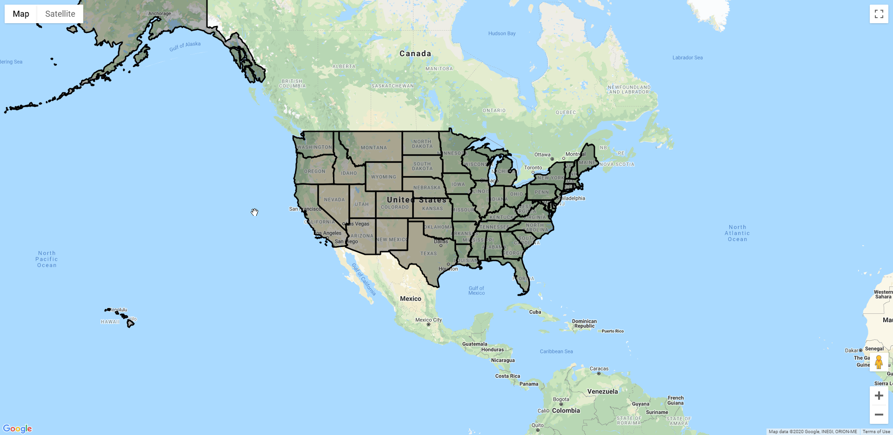
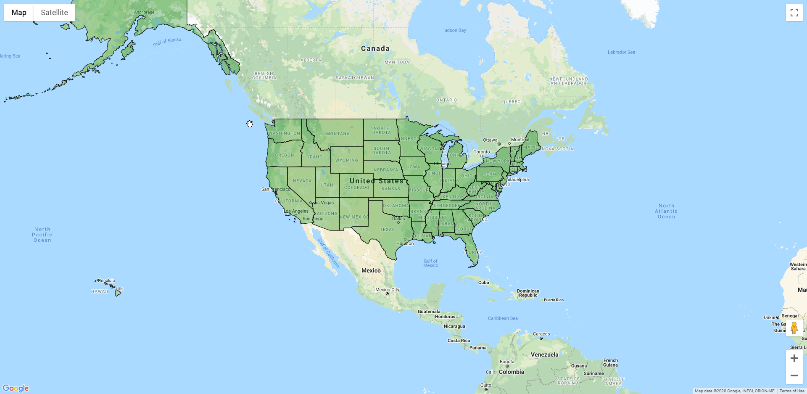

## How to Overlay Polygon Shapes Onto Google Maps ##

In this tutorial, I'll teach you how to overlay polygon shapes onto Google Maps and embed it into a website. The example we will use will be to overlay the US census' states data. Data processing will be done with mapshaper.org which you can learn more about [here](https://simplemaps.com/resources/guide-to-mapshaper).

#### 1. Use the Google Maps JavaScript API to embed a basic map of the US
The first step is to add a Google Maps JavaScript application in your website. To do this you must first create a Google Cloud Platform Project which you can read about [here](GoogleCloudProjectSetup). (Important) When adding the API use the Maps JavaScript API instead of the Maps embed API.

#### 2. Add application to website

Once this setup is done you can start adding code to your website. The code required is very simple.

Add these lines into you style section or with your css

    #map {
    	height: 100%;
    }

These lines are optional: Makes the sample page fill the window
    
	html, body {
	    height: 100%;
	    margin: 0;
	    padding: 0;
    }

If you don't have a style section add these lines then insert the above code inside it

	

The result should look something like this

    

Then insert this lines where ever you want your map to be located on your website

    

Insert this line with the rest of your scripts or if you have none, place it at the bottom of your html section. Replace "YOUR_KEY_HERE" with the key from your project

	
    

#### 2. Get data
Once you have Google Maps embedded into your website, you can add geographic data to it.

For, this tutorial we'll be getting our U.S. state data from the  [US Census Bureau](https://www.census.gov/geographies/mapping-files/time-series/geo/carto-boundary-file.html "census.gov"). A cleaned version has already been preformatted for you to click on and download [here](C:\Users\benel\Documents\GitHub\belfner.github.io\index_files\states.zip "states.zip").

You'll need to unzip the folder of data before moving forward.

#### 3. Convert to GEOJSON
To use this data with Google Maps it will need to be converted from the Shapefile format to the GeoJSON format. To do this you will first need to upload it to [mapshaper.org](https://mapshaper.org/). This gives us an easy method to convert between different geographic data formats. 

1. Go to [mapshaper.org](https://mapshaper.org/)
2. Open the unziped folder with the states data
3. Select and drag all of the files from your computer and drop them within the mapshaper.org browser window
4. Click Import
5. If you did things properly, you should see the map appear. Click on the information icon and hover over a state to make sure that MapShaper has imported the associated data for each state

######*Optional:*######
*If you want to manipulate the data of the polygons, you can view the "Editing Shapefiles with MapShaper" section on our [guide to MapShaper](https://simplemaps.com/resources/guide-to-mapshaper).*

Finaly, to export the data:

1. Click on the Export button in the top right corner of the webite
2. Select GeoJSON as the File format on the window that popped up
3. Click Export

This will download the data in the GeoJSON format.

#### 4. Add GEOJSON Google Maps

To add the data to the embedded map:

1. Upload the downloaded file to your website
2. Add this line of code to initMap() and replace "PATH" with the path to the GeoJSON file on your website

	`map.data.loadGeoJson('PATH');`

	a example of this could be

	`map.data.loadGeoJson('http://example.com/states.json');`

	your code should end up like this
	
	    

			
		

Test your website and you should see the shapes on the map

#### 5. Adjust the color of the shapes
To customize the formatting of the shapes:

Use this basic outline to add styles

    map.data.setStyle({
      "style":"value"
    });

Here is an example of what your code could look like

	map.data.setStyle({
		fillColor: 'green',
		strokeWeight: 1
	});

and this would be inserted into your website code in the initMap() function like this

	
			

This will make the map look like this

#### 6. Make shapes clickable

Finally, to display information when clicking on a shape a few more lines will be added

First add this line in the initMap() function

    var infowindow = new google.maps.InfoWindow();

Now you need to create a custom feature where you can choose what will be displayed on a click. The basic outline will look like this. 

	map.data.addListener('click', function(event) {
	  ...
	  infowindow.setContent(html); // show the html variable in the infowindow
	  infowindow.setPosition(event.latLng); // anchor the infowindow at the marker
	  infowindow.setOptions({pixelOffset: new google.maps.Size(0,-30)}); // moves the infowindow up slightly to the top of the marker icon
	  infowindow.open(map);
	});

The text you want to display needs to be put in the html variable. To get information from the shape that was clicked on you need to specify the name of the attribute you want in this line of code

	event.feature.getProperty("...");

An example

	let state = event.feature.getProperty("unit_type");
	let html = 'State: ' + state; // combine state name with a label	
	  
