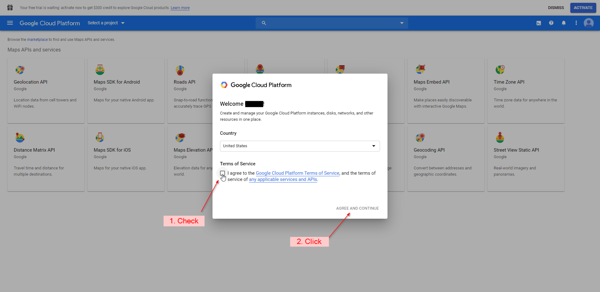
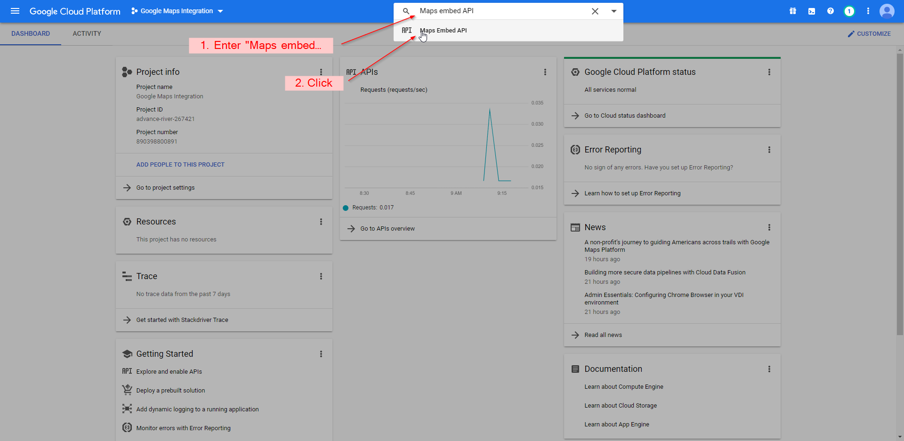

## How to Overlay Polygon Shapes Onto Google Maps ##

In this tutorial, I'll teach you how to overlay polygon shapes onto Google Maps and embed it into a website. The example we will use will be to overlay the US census' states data. Data processing will be done with mapshaper.org which you can learn more about [here](https://simplemaps.com/resources/guide-to-mapshaper).

#### 1. Use the Google Maps JavaScript API to embed a basic map of the US
The first step is to embed a basic Goolgle Map application in your website. To do this you must first create a Google Cloud Platform Project. 

1. Go to [cloud.google.com](https://cloud.google.com/) and click on "Get Started for Free" 
2. Log in with your Gmail account
3. Check I agree and then click on "AGREE AND CONTINUE"
4. Click "Select a Project" and then "NEW PROJECT" on the pop-up window 
5. Give the project a name then click "CREATE"
6. Once the project is set up shown by the notification window, click "Select a Project", choose the project you just created 
7. If you have not used Google cloud services before, you can claim $300 of credit. This will require you to enter a credit/debit card. Since the Google Maps API costs money already, it is recommended for you to take the free money. You do this by clicking "ACTIVATE" on the notification at the top right of the website. If you have already accepted this offer  on another project, skip to step 10
8. Check the box then click "CONTINUE"
9. Enter all information. It is up to you to you if you want to enable automatic billing. Click "START MY FREE TRIAL" when done. Skip to step 15
10. Click billing in the menu on the left of the window
11. If you already have a billing account, click "Link  a billing account". Otherwise click "Manage billing accounts
12. Needs continuing
13. .
14. .
15. Once back on the main menu, search for "Maps embed API" and click on the corresponding item in the results menu
16. When the page loads, click "Enable"
17. Now search for "APIs & Services" and click on the corresponding item in the results menu
18. Click "Credentials" on the left menu
19. Click "CREATE CREDENTIALS" then click "API key"
20. It is recommended to restrict your key so it will only work with your website. To do this click "RESTRICT KEY", otherwise skip to step 23
21. You can rename your key on this page. Under "Application restrictions" click "HTTP referrers", then click "ADD AN ITEM"
22. Enter your full website domain name then click "Done"
23. Scroll down and click "Save"
24. 

Once this setup is done you can start adding code to your website. The code required is very simple.

Insert these lines where ever you want your map to be located on your website

    

		
	

Insert this line with the rest of your scripts or if you have none, place it at the bottom of your html section

    

#### 2. Get data
Once you have Google Maps embedded into your website, you can add geographic data to it.

For, this tutorial we'll be getting our U.S. state data from the  [US Census Bureau](https://www.census.gov/geographies/mapping-files/time-series/geo/carto-boundary-file.html "census.gov"). A cleaned version has already been preformatted for you to click on and download [here](C:\Users\benel\Documents\GitHub\belfner.github.io\index_files\states.zip "states.zip").

You'll need to unzip the folder of data before moving forward.

#### 3. Convert to GEOJSON
To use this data with Google Maps it will need to be converted from the Shapefile format to the GeoJSON format. To do this you will first need to upload it to [mapshaper.org](https://mapshaper.org/). This gives us an easy method to convert between different geographic data formats. 

1. Go to [mapshaper.org](https://mapshaper.org/)
2. Open the unziped folder with the states data
3. Select and drag all of the files from your computer and drop them within the mapshaper.org browser window
4. Click Import
5. If you did things properly, you should see the map appear. Click on the information icon and hover over a state to make sure that MapShaper has imported the associated data for each state.

######*Optional:*######
*If you want to manipulate the data of the polygons, you can view the "Editing Shapefiles with MapShaper" section on our [guide to MapShaper](https://simplemaps.com/resources/guide-to-mapshaper).*

Finaly, to export the data:

1. Click on the Export button in the top right corner of the webite
2. Select GeoJSON as the File format on the window that popped up
3. Click Export

This will download the data in the GeoJSON format.

#### 4. Add GEOJSON Google Maps

To add the data to the embedded map:

1. Move the downloaded file to your websites folder
2. 

#### 5. Adjust the color of the shapes

#### 6. Make shapes clickable