## Setting up a Google Cloud project ##

In this tutorial, you will learn about the basics of setting up a new Google Cloud project and setting up an API. This will allow you to take advantage of the many services it offers. This tutorial assumes you are new to Google Cloud.

#### 1. Creating the project

1. Go to [cloud.google.com](https://cloud.google.com/) and click on "Get Started for Free" 
2. Log in with your Gmail account
3. Check I agree and then click on "AGREE AND CONTINUE" 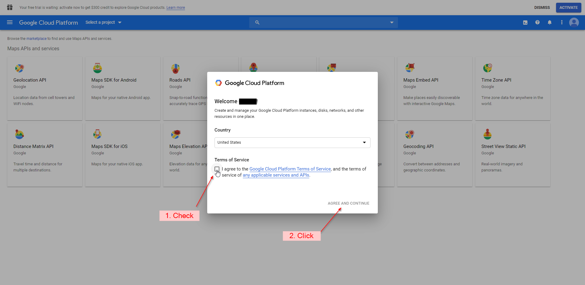
4. Click "Select a Project" and then "NEW PROJECT" on the pop-up window 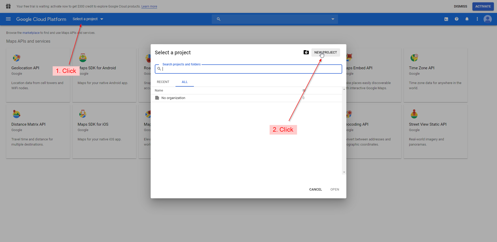
5. Give the project a name then click "CREATE" 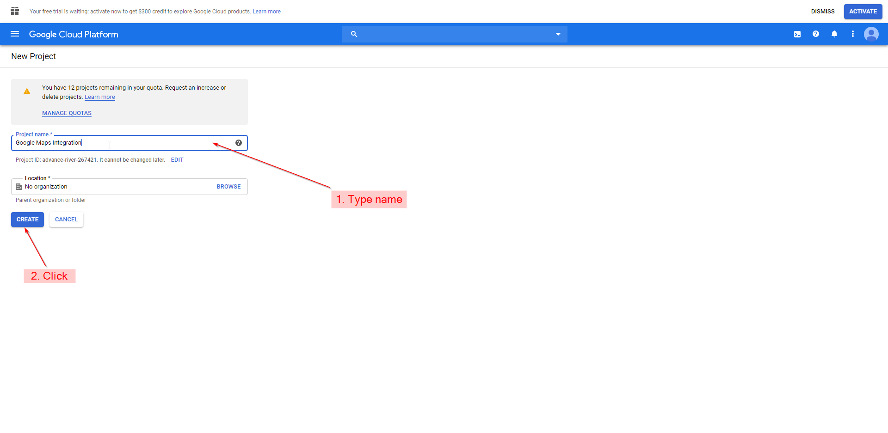
6. Once the project is set up shown by the notification window, click "Select a Project", choose the project you just created and click open 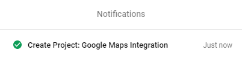 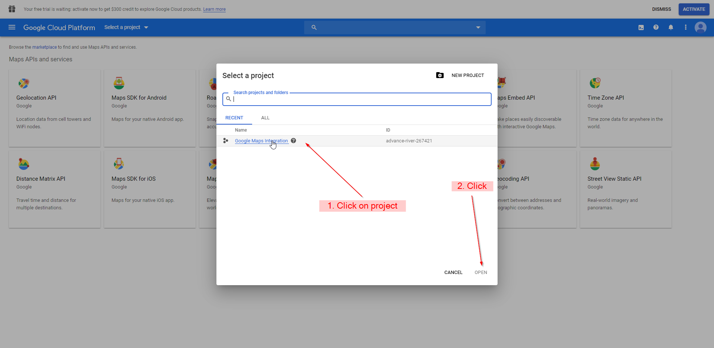
7. If you have not used Google cloud services before, you can claim $300 of credit. This will require you to enter a credit/debit card. Since the Google Maps API costs money already, it is recommended for you to take the free money. You do this by clicking "ACTIVATE" on the notification at the top right of the website. 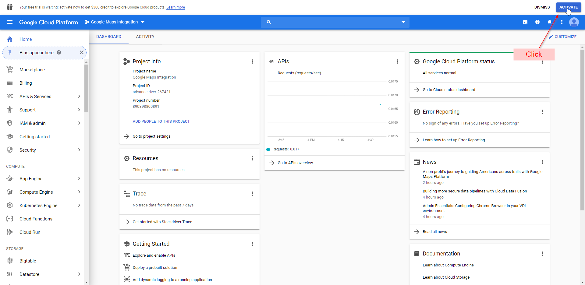 
	###### *Note: If you don't have this notification click the menue button in the top right corner of the screen. Then click billing. When the page loads click "Manage billing accounts. This will bring you to the correct screen
8. Check the box then click "CONTINUE" 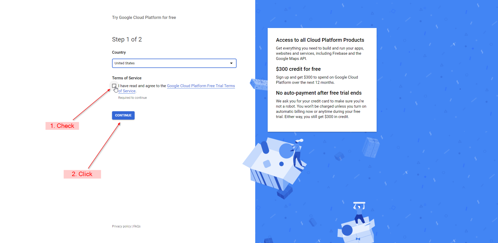
9. Enter all information. It is up to you to you if you want to enable automatic billing. Click "START MY FREE TRIAL" when done

Now you have a new project with billing enabled that is ready to go.

#### 2. Using APIs and create credentials 
1. Once you are back on the main menu, you can enable any API. We will use the Maps embed API as an example. Search for "Maps embed API" and click on the corresponding item in the results menu 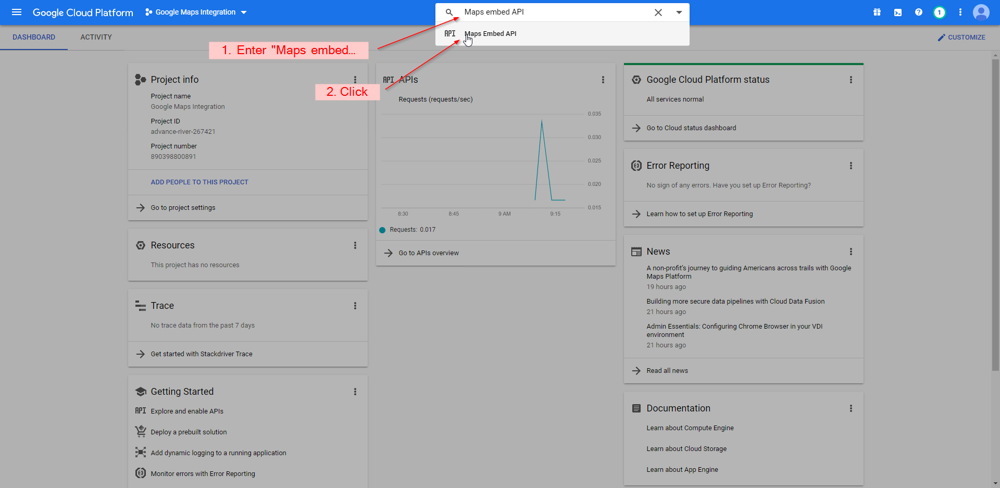
2. When the page loads, click "Enable" 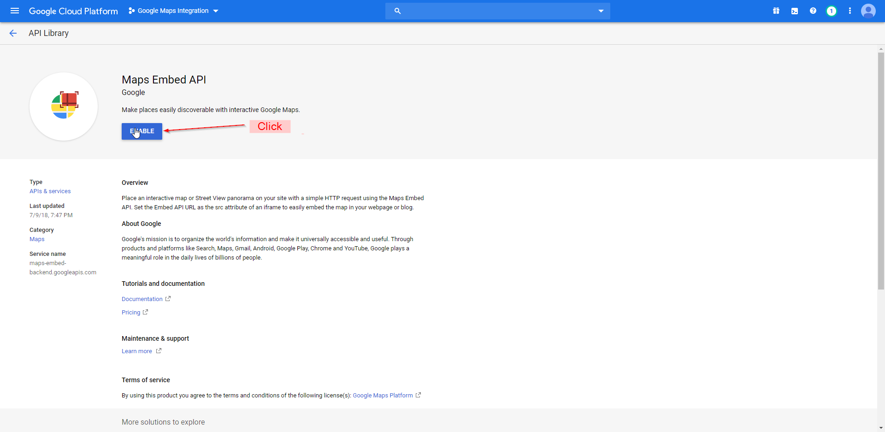
3. Now search for "APIs & Services" and click on the corresponding item in the results menu 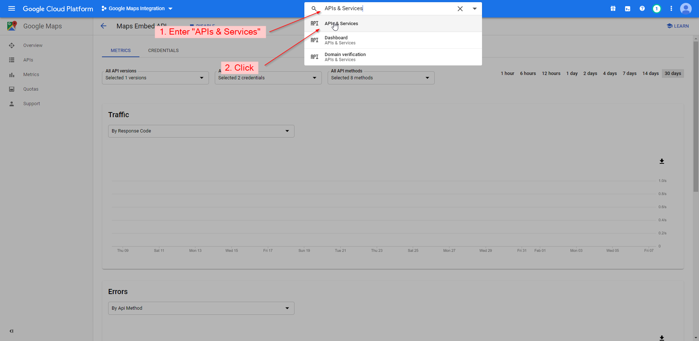
4. Click "Credentials" on the left menu 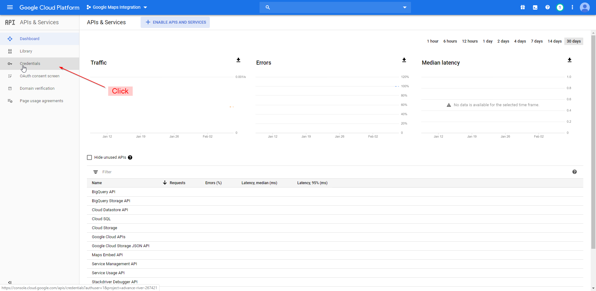
5. Click "CREATE CREDENTIALS" then click "API key" 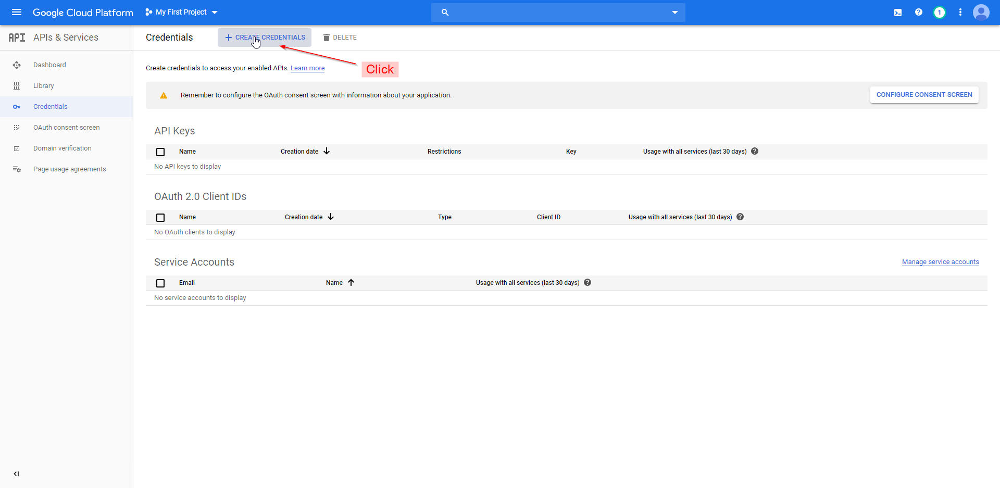
6. It is recommended to restrict your key so it will only work with your website. To do this click "RESTRICT KEY", otherwise skip to the setup 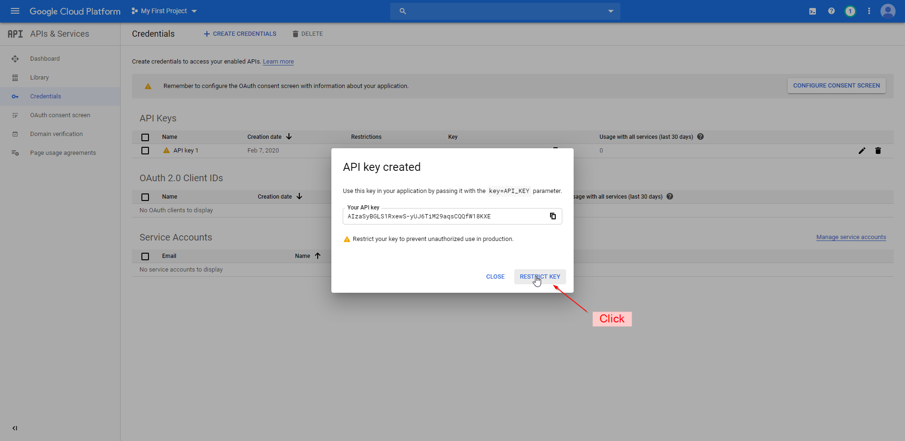
7. You can rename your key on this page. Under "Application restrictions" click "HTTP referrers", then click "ADD AN ITEM" 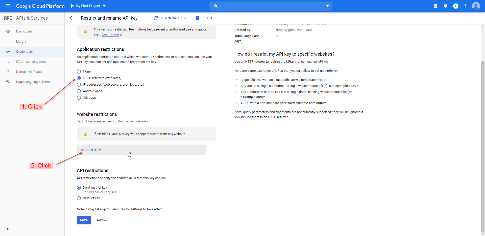
8. Enter your full website domain name then click "Done" 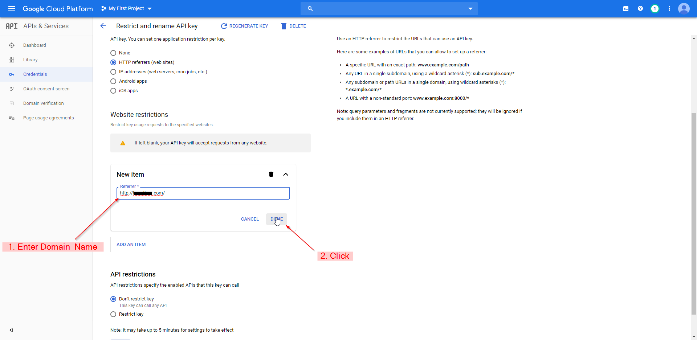
9. Scroll down and click "Save" 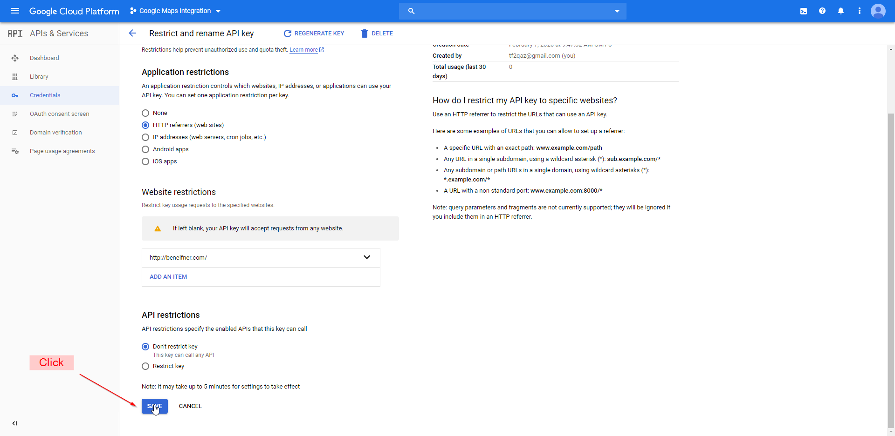
